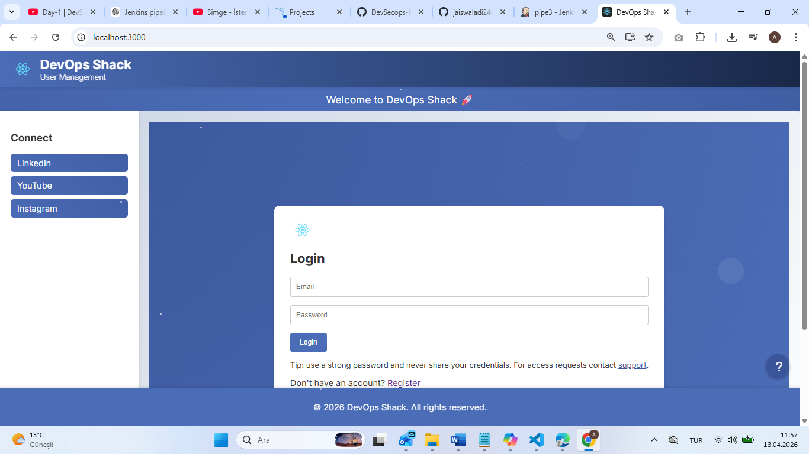
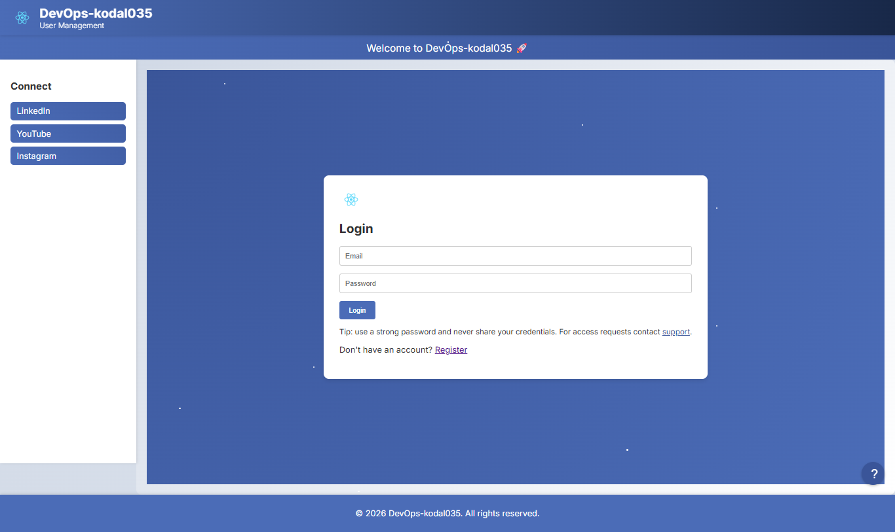
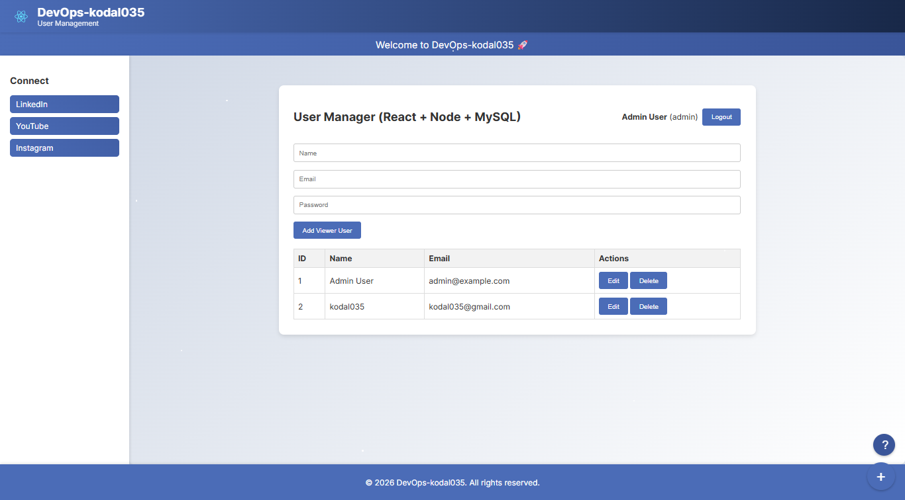
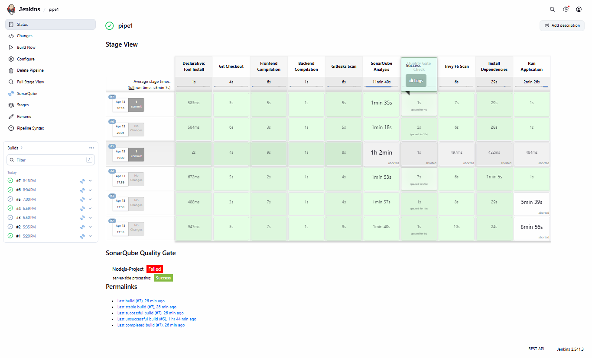
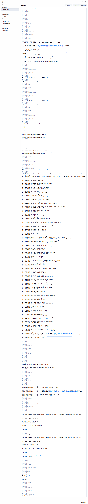
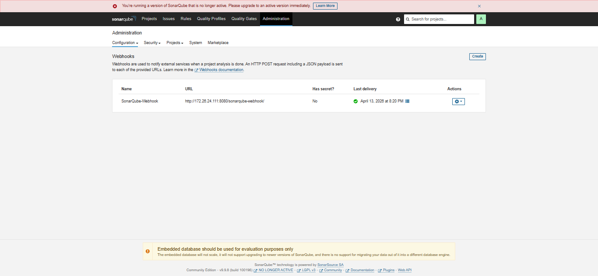
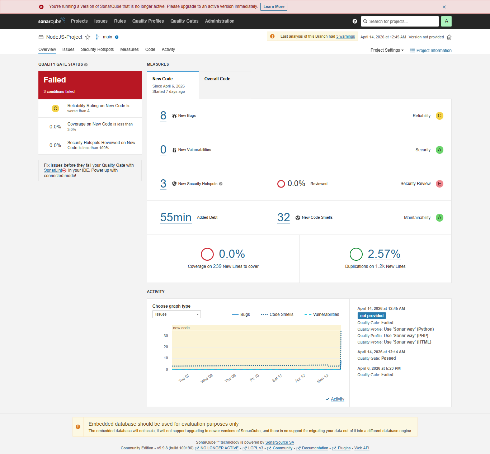
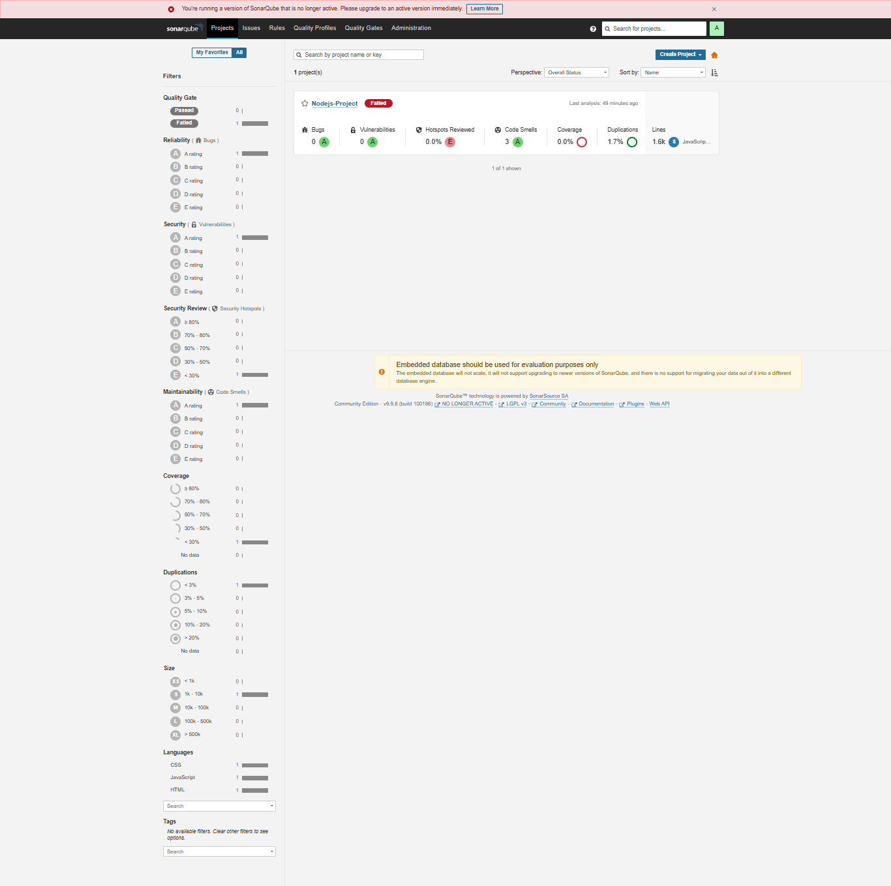

# Project 01: Node + React + MySQL DevSecOps

This project is a hands-on DevSecOps learning example.
Its goal is to show a real CI workflow where source code is checked, analyzed, and scanned for security risks.

Tech stack:

- Node.js API (`api`)
- React client (`client`)
- MySQL
- Jenkins
- SonarQube
- Gitleaks
- Trivy

## Repository Structure

```text
Project-01-node-react-mysql-devsecops/
├── Jenkinsfile_CI
├── README.md
├── mysql-setup.md
├── api/
├── client/
└── pictures/
```

## 1. Installation Order (Do This in Sequence)

1. Ubuntu or WSL2 Ubuntu
2. Git
3. Docker
4. Node.js (18+ recommended)
5. npm
6. MySQL Server

Note: The Jenkins agent environment must include all tools used in the pipeline (SonarScanner, Gitleaks, Trivy).

## 2. Clone the Project

```bash
git clone https://github.com/kodal035/DevSecops-Practical-Projects.git
cd DevSecops-Practical-Projects
```

## 3. MySQL Preparation

Follow the steps in `mysql-setup.md`.

Expected database objects:

- Database: `crud_app`
- Table: `users`

## 4. Start Jenkins and SonarQube (Docker)

### 4.1 Start Jenkins

```bash
docker volume create jenkins_home
docker network create devsecops-net

docker run -d \
  --name jenkins \
  --restart unless-stopped \
  -p 8080:8080 \
  -p 50000:50000 \
  -v jenkins_home:/var/jenkins_home \
  --network devsecops-net \
  jenkins/jenkins:lts-jdk17
```

Jenkins URL: `http://localhost:8080`

### 4.2 Start SonarQube

```bash
docker run -d \
  --name sonar \
  --restart unless-stopped \
  -p 9000:9000 \
  --network devsecops-net \
  sonarqube:lts-community
```

SonarQube URL: `http://localhost:9000`

## 5. Required Jenkins Configuration

### 5.1 Plugins

- Git plugin
- Pipeline
- NodeJS
- SonarQube Scanner for Jenkins
- Credentials Binding

### 5.2 Tools

Set these exact names in `Manage Jenkins -> Tools`:

- NodeJS: `nodejs23`
- SonarScanner: `sonar-scanner`

### 5.3 Credentials

At minimum, create:

- Sonar token (`Secret text`) id: `sonar-token`

### 5.4 SonarQube Server in Jenkins

In `Manage Jenkins -> System`, add SonarQube server:

- Name: `sonar`
- URL: `http://<sonarqube-host>:9000`
- Token credential: `sonar-token`

### 5.5 SonarQube Webhook

Add this webhook in SonarQube:

```text
http://<jenkins-host>/sonarqube-webhook/
```

## 6. Current Jenkinsfile_CI Flow (As-Is)

Current stages in `Jenkinsfile_CI`:

1. Git Checkout
2. Frontend Compilation (`node --check`)
3. Backend Compilation (`node --check`)
4. GitLeaks Scan
5. SonarQube Analysis
6. Quality Gate Check
7. Trivy FS Scan

Notes:

- Checkout currently uses fixed `main` branch and repository URL.
- Current Sonar scanner params in pipeline:
  - `sonar.projectName=NodeJS-Project`
  - `sonar.projectKey=Nodejs-Project`

## 7. Optional Local Validation Before CI

### Start backend

```bash
cd api
npm install
npm start
```

### Start frontend

```bash
cd client
npm install
npm start
```

### Run unit tests

Frontend:

```bash
cd client
CI=true npm test -- --coverage --runInBand
```

Backend:

```bash
cd api
npm test -- --coverage
```

## 8. Run the CI Pipeline

1. Create a new Pipeline job in Jenkins.
2. Connect this repository as SCM.
3. Use script path: `Project-01-node-react-mysql-devsecops/Jenkinsfile_CI`.
4. Click Build Now.
5. Verify each stage in order.

Expected service URLs:

- Jenkins: `http://localhost:8080`
- SonarQube: `http://localhost:9000`
- Frontend: `http://localhost:3000`
- Backend: `http://localhost:5000`

## 9. Test Note (Jest + Axios)

To avoid Axios ESM transform issues in CRA/Jest, the client uses this in `client/package.json`:

```json
"jest": {
  "transformIgnorePatterns": [
    "node_modules/(?!(axios)/)"
  ]
}
```

## 10. Implemented Unit Tests

- Frontend route-guard test: `client/src/AlwaysPass.test.js`
- Backend auth middleware test: `api/middleware/auth.test.js`

## Screenshots

Project screenshots are under `pictures/`.

### Main Page



### Frontend - Login/Register View 1



### Frontend - Login/Register View 2


### Frontend - Dashboard



### Jenkins Pipeline



### Jenkins Console Output



### SonarQube Webhook Settings



### SonarQube Dashboard



### SonarQube Projects



## Notes

- Keep secrets out of git (`.env`, tokens, passwords).
- If `git status` shows incorrect ahead/behind after push, run:

```bash
git fetch origin
git status
```
